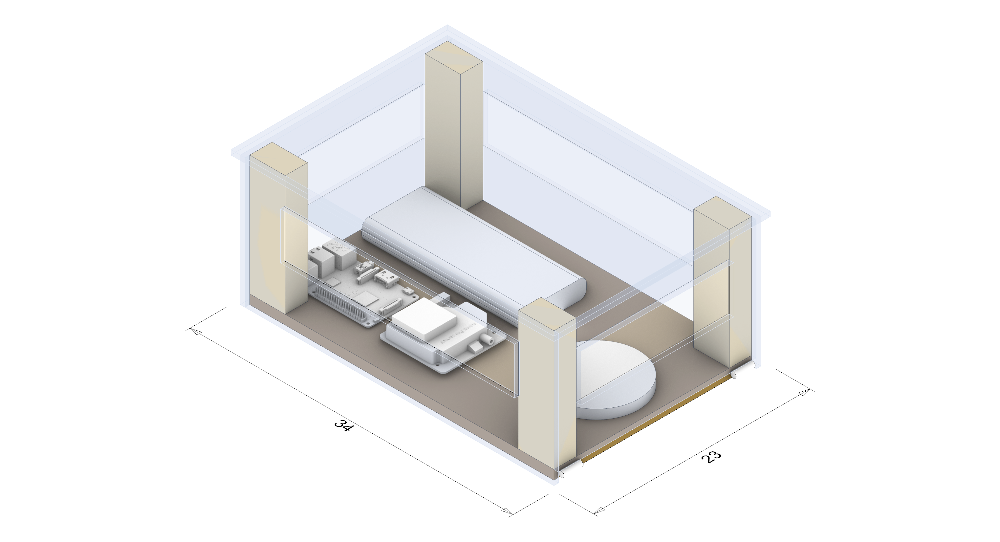
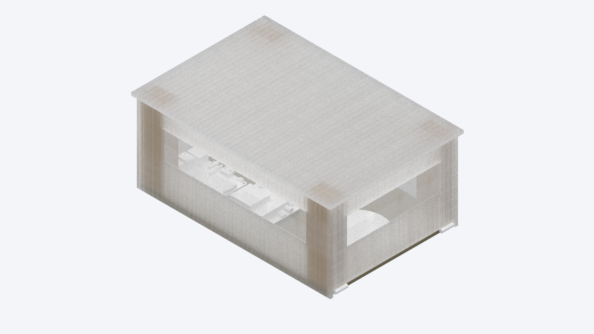

# Capture Box

This is the program running on the capture box.

## Deployment

### Balena

These instructions are for the usage with Balena. For direkt usage with Docker scroll down.

#### Requirements

- [Balena](https://docs.balena.io/)

#### Build

To build to the Balena-Application named "ToxSense-CaptureBox" run:

```
$ make balena
```

This will build and upload the Balena-Dockerfile to the application and deploy the release to the whole fleet.

#### Environment Variables

In balena you have to define the following variables:

```
CAPTURE_INTERVAL = 10  # Interval the data is captures in SECONDS
CAPTURE_TIME = 5  # Time the capture is made in MINUTES
TG_PWD = examplePass  # Password for the Telegram-bot
TG_TOKEN = 123456:example_Tok3n  # Telegram-bot token dispensed by the @BotFather
```

### Docker (alternative)

Use these instructions are for usage with a standard Dockerimage.

#### Requirements

- [docker](https://docs.docker.com/)

#### Build Dockerfile

```
$ make build
```

This will build the Dockerfile-Container.


## Usage

In telegram you can use the following commands:

```
/start PWD  # Login with the defined (environment variables) password
/capture  # Start the capturing process
/cancel  # cancel the current capturing process
```

## TODO:

- Add sensor libraries
- Add *ALL* the sensors to the main script



